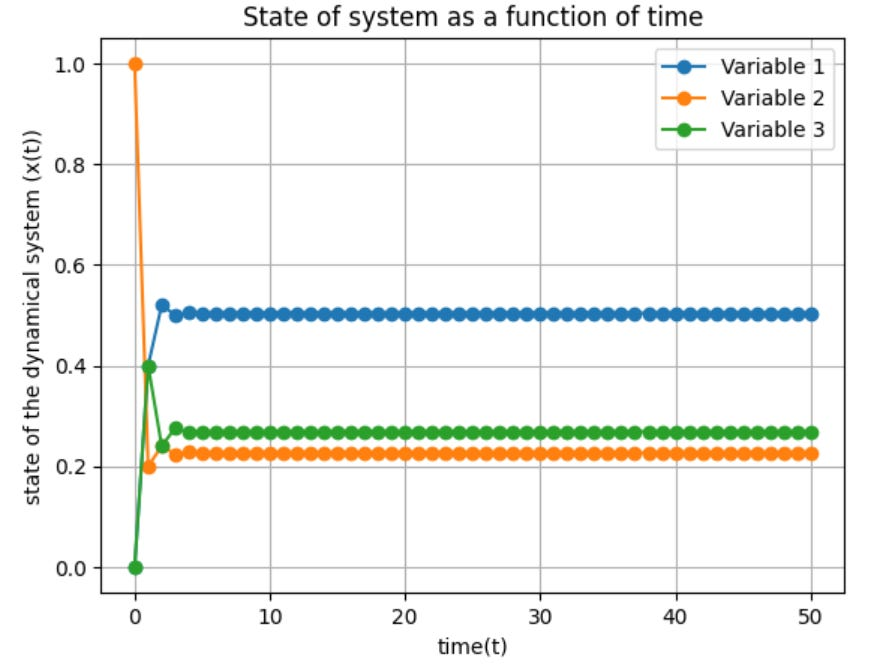

# An Introduction To Dynamical Systems 
A dynamical system is a framework used to understand and predict how the behavior of complex systems evolve and change over time. At its core, a dynamical system consists of a finite set of variables, each representing a quantity of interest, and a predefined set of rules that govern how these variables change over time. 

By defining a set of variables and their evolutionary rules, we can capture the essence of dynamic phenomena and gain insights into their future states, which can be used to model a wide range of systems. For example, in biology dynamical systems may be used to model population dynamics, disease spread, and interactions between specifies, while in economics they may be used to represent market dynamics, the evolution of stock prices, and the behavior of economic indicators.   

Dynamical systems can be incredibly complex to model, but that need not be the case. In the next section, I’ll demonstrate how to model a simple linear dynamical system. 

# Modeling Dynamical Systems 

Imagine we have two wildlife reserves (A and B) separated by a bridge, and we want to understand how a population of antelopes disperses through the two areas of land from month to month. Through statistical sampling, we learn that 80% of the antelopes in Reserve A will remain in Reverse A from one month to the next, whereas 20% will move to Reserve B. On the converse, we learn that 90% of antelopes in Reserve B will remain there from one month to the next, and the other 10% will migrate to Reserve A. 

Now, let's say xa(t) is the % of antelopes on reserve A at time t, and xb(t) is the % of antelopes on reverse B at time t. Then, x(t) = [[xa(t)], [xb(t)]] is the dynamical system whose state at time t is formed by the vector x(t). If t=0 is the system's initial state, where each reserve contains 50% of the antelope population, we can say x(0) = [0.5, 0.5]. 

To forecast over longer periods, we call the previously computed state of the system t=k, and use known values of xa(k) and xb(k) to compute values of xa(k+1) and xb(k+1), which are the future states of the system. This system can be expressed with the following matrix: [[xa(k+1)],[xb(k+1)]] = [[0.8, 0.1],[0.2, 0.9]][[xa(k)],[xb(k)]]

For example, if we want to know the state of the system after one month, we can perform the following calculation: [[xa(1)],[xb(1)]] = [[0.8, 0.1],[0.2, 0.9]][[0.5],[0.5]] = [[0.45],[0.55]]. 

The equation above tells us that if at month zero, 50% of the antelope population is in each reserve, then 45% will be in reserve A and 55% in reserve B one month later. In the code block below, I’ll show you how to model this dynamical system over longer periods:
```python
import numpy as np
import matplotlib.pyplot as plt

system_rules =  np.array([[0.75, 0.15],[0.25, 0.85]])
initial_state = np.array([[0.4],[0.6]])
cycles = 100

def dynamical_system_generator(system_rules, initial, cycles):
  state_at_t = [] #state at time t, aka x(t)
  state_at_t.append(initial)
  for i in range(0,cycles):
    t_plus_1 = np.dot(system_rules,state_at_t[i])
    state_at_t.append(t_plus_1)
  state_at_t_tuples = [tuple(np.round(array.flatten(), 3)) for array in state_at_t]

  variable_1 = [t[0] for t in state_at_t_tuples]
  variable_2 = [t[1] for t in state_at_t_tuples]

    # Create a scatter plot
  fig, ax = plt.subplots()
  ax.plot(range(len(variable_1)), variable_1, label='Variable 1', marker='o')
  ax.plot(range(len(variable_2)), variable_2, label='Variable 2', marker='o')
  ax.set_xlabel('time(t)')
  ax.set_ylabel('state of the dynamical system (x(t))')
  ax.set_title('State of system as a function of time')
  ax.legend()
  ax.grid(True)
  return fig, ax and state_at_t_tuples

print(dynamical_system_generator(dynamical_system, initial_state, cycles))
```
Which, produces the following output: 


As you can see, early on, there are large changes in the distribution of the antelope population month to month, but after ~10 months, the populations begin to stabilize with ~33% of antelopes on Reserve A and ~67% of Reserve B.

Our analysis above underscores the intricate nature of dynamical systems. A dynamical system reaches a steady state when the variables describing the system's state stop changing over time. This can occur when the forces or factors driving changes in the system balance each other out, leading to a situation where there is no net change. Importantly, the equilibrium point of a dynamical system is not a fixed value, but rather, it is heavily influenced by the initial state and the rules governing the system. Even minor changes to these variables can have profound effects on the system's behavior, a phenomenon that becomes more pronounced as systems increase in complexity. 

# Markov Chains 

A Markov chain is a type of dynamical system where the exact state of the variables isn't known for sure, so they are expressed as probabilities. These systems are called stochastic processes because their future states depend on both predictable factors and inherent randomness.

In stochastic processes with n possible states, the state vector at any time t is represented as x(t)=[x1(t),x2(t),…,xn(t)]. Each entry in this vector is the probability that the system is in a particular state, and the sum of all entries equals 1.

In Markov chains, the state vectors at successive time intervals are probability vectors and are related by the equation x(k+1)=Px(k). Here, P=[pij] is a stochastic matrix called a transition matrix. In this matrix, the row index i corresponds to the state at time t=k+1, and the column index j corresponds to the state at time t=k.

Like linear dynamical systems, we can use Markov chains to model animal migrations between reservers, but instead of finding the distribution of a population of antelopes across multiple reserves we will instead find the probability that single tiger resides in one of three reserves (reserve A, B, and C). If, at t=0 we know with certainty that the tiger is in reserve B, we can express the state vector of the system as x(0) = [0, 1, 0], reflecting the fact that there is a 0% probability the tiger is in reserve A or C, and an 100% probability it’s in reverse B. 

In the code block below, I’ll show you how to model this dynamical system over longer stretched of time:
```python
transition_matrix =  np.array([[0.5, 0.4,0.6],[0.2, 0.2, 0.3], [0.3, 0.4, 0.1]])
initial_state = np.array([[0],[1],[0]])
cycles = 50

def markov_model(transition_matrix, initial, cycles):
  state_at_t = []
  state_at_t.append(initial)
  for i in range(0,cycles):
    t = np.dot(transition_matrix, state_at_t[i])
    state_at_t.append(t)
  state_at_t_tuples = [tuple(np.round(array.flatten(), 3)) for array in state_at_t]
  variable_1 = [t[0] for t in state_at_t_tuples]
  variable_2 = [t[1] for t in state_at_t_tuples]
  variable_3 = [t[2] for t in state_at_t_tuples]

  fig, ax = plt.subplots()
  ax.plot(range(len(variable_1)), variable_1, label='Variable 1', marker='o')
  ax.plot(range(len(variable_2)), variable_2, label='Variable 2', marker='o')
  ax.plot(range(len(variable_3)), variable_3, label='Variable 3', marker='o')
  ax.set_xlabel('time(t)')
  ax.set_ylabel('state of the dynamical system (x(t))')
  ax.set_title('State of system as a function of time')
  ax.legend()
  ax.grid(True)
  return fig, ax and state_at_t_tuples

print(markov_model(transition_matrix, initial_state, cycles))
```
Which, produces the following output:

As you can see in the chart above, after ~5 months the system stabilizes and there is a ~50, ~23, and ~27% chance that the tiger is in reserve A, B, and C respectively.

# Long Term Behavior of Dynamical Systems 

Understanding the long-term behavior of dynamical systems and Markov chains is crucial for predicting how these systems evolve over time and identifying the stable patterns or states they might reach.

These systems can exhibit various behaviors over the long term:
- Equilibrium (Steady State): The system reaches a point where variables no longer change over time, as is the case in both examples above. 
- Periodic Behavior: The system enters repeating cycles.
- Quasi-Periodic Behavior: The system's behavior is almost periodic, but not exactly repeating.
- Chaotic Behavior: The system behaves in complex, seemingly random ways.
- Attractor Behavior: The system's states evolve toward specific sets of states called attractors.

Recognizing these behaviors is essential for understanding the stability and predictability of the system. For example, in ecological models, knowing whether populations will stabilize, oscillate, or behave chaotically can help develop effective conservation strategies.
